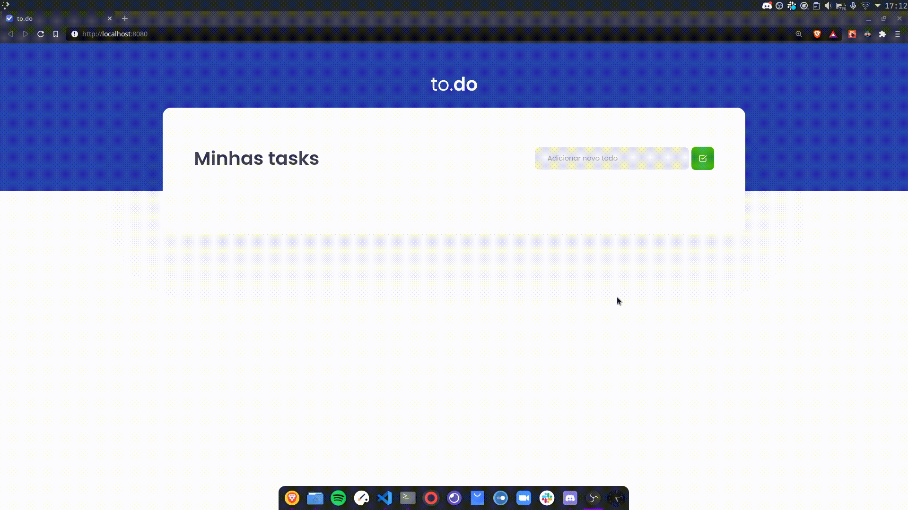

# to.do

Uma aplicação de gerenciamento de tarefas desenvolvida durante o primeiro desafio do Ignite, bootcamp da [Rocketseat](https://rocketseat.com.br/), especificamente, da Trilha de ReactJS. O projeto foi desenvolvido a partir de um template previamente disponibilizado.

O foco do projeto é ampliar, na prática, a compreensão dos Conceitos Fundamentais do ReactJS. O objetivo é uma pequena aplicação de atividades a fazer, para treinar um pouco mais sobre manipulação do estado no React. Para isso, foi desenvolvido (da minha parte) toda a lógica para:

1. Adicionar uma nova tarefa;
2. Remover uma tarefa;
3. Marcar e desmarcar uma tarefa como concluída.

## Funcionamento da Aplicação

No gif abaixo é possível conferir o funcionamento da aplicação após a adição dos recursos solicitados:

